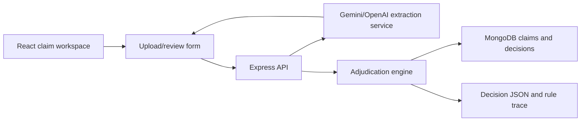

# Architecture

## Components

### React Client

Provides three views:

- Submit Claim: upload prescription/bill PDFs or images, extract fields, review/edit the structured claim, and receive a decision.
- Test Cases: run all provided Plum scenarios.
- History: view persisted claims when MongoDB is connected.

### Express API

Owns claim intake, test-case execution, and MongoDB persistence.

### Extraction Service

Accepts pasted document text and uploaded files. When `GEMINI_API_KEY` is configured, it uses Gemini to extract structured claim JSON from text, images, and PDFs. If Gemini is unavailable, it can use OpenAI through `OPENAI_API_KEY`. If all LLM calls fail, it falls back to a deterministic local parser so the demo remains reliable.

The extraction output includes member details, prescription fields, bill line items, GST/tax when present, full claim amount, extraction method, and confidence score.

### Adjudication Engine

Applies policy and business rules in priority order:

1. Eligibility and policy date
2. Fraud/manual review indicators
3. Required documents
4. Doctor registration
5. Submission timeline and minimum amount
6. Waiting periods
7. Exclusions and pre-authorization
8. Partial approval scenarios
9. Claim limits
10. Co-pay, discounts, and final amount

### MongoDB

Stores submitted claims and decisions. The app can run without MongoDB for demo and validation.
