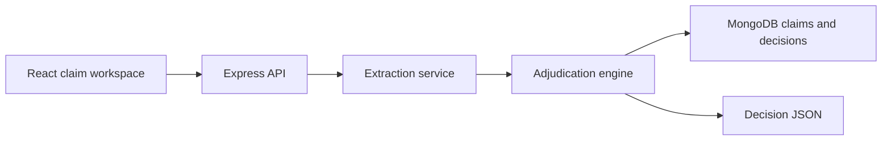

# Architecture

## Components

### React Client

Provides three views:

- Submit Claim: paste structured claim data and receive a decision.
- Test Cases: run all provided Plum scenarios.
- History: view persisted claims when MongoDB is connected.

### Express API

Owns claim intake, test-case execution, and MongoDB persistence.

### Extraction Service

Currently normalizes structured JSON input. In production, this is where OCR and LLM document extraction should be added.

### Adjudication Engine

Applies policy and business rules in priority order:

1. Eligibility and policy date
2. Fraud/manual review indicators
3. Required documents
4. Doctor registration
5. Submission timeline and minimum amount
6. Waiting periods
7. Exclusions and pre-authorization
8. Partial approval scenarios
9. Claim limits
10. Co-pay, discounts, and final amount

### MongoDB

Stores submitted claims and decisions. The app can run without MongoDB for demo and validation.
