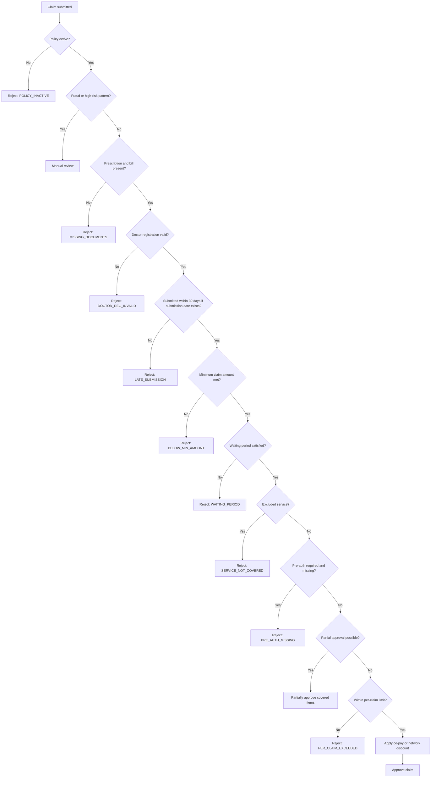

# Decision Flow

## Priority Rules

- Fraud and safety concerns go to manual review early.
- The 30-day submission timeline is checked only when a submission date is available.
- GST/tax is included in the itemized claim amount when it appears on a bill.
- Exclusions and pre-authorization checks happen before amount limits.
- Partial approval is supported for mixed covered and excluded items.
- Hard limits are enforced when partial approval does not apply.
- Every response includes a rule trace for explainability.
